name: inverse
layout: true
class: center, middle, inverse
---
# ENSE 350: Math for Software Eng.

### Problem Set 1

Adam Tilson, M.A.Sc., Engineer-in-Training

---
layout: false
## Part 1: Logic foundation to proofs

Q1. Rewrite the following using the following statements into logical notation:

"If a real number is an integer, then it is a rational number"
[Use notations $\mathbb{R}$ for real numbers, $\mathbb{Z}$ for integers, $\mathbb{Q}$ for rational numbers]

"Every real number has an additive inverse".
[An additive inverse of a real number $x$, is a real number $y$, such that $x + y = 0$]

"No person is immortal"
[Let $P(x)$ be "$x$ is a person", $I(x)$ be "$x$ is immortal"]
---
Q2. Show if the following inference rules are sound:

$\frac{\neg Q, P \Rightarrow Q}{\neg P}$

$\frac{P}{P \vee Q}$

$\frac{P \wedge Q}{P}$

---
Q3. Which of the following implications are true?

- $3+2=5 \Rightarrow 2+2=6$

- $2+3=4 \Rightarrow $ The world is flat

- $1+1=2 \Rightarrow 2+3=5$

---
## Part 2: Intro to Proofs

Q4. Prove the following theorem:

$5n^3$ is an even integer iff $n$ is even

Q5. Prove the theorem:
if $r$ is irrational, then $r^{\frac{1}{5}}$ is irrational.

Q6. Prove the theorem:
Let $x, y \in \mathbb{Z}$. Prove that $xy$ is even iff $x$ or $y$ is even.
---

## Part 3: Induction
Q7. Use the principle of induction to prove that, for all non-negative integers, $n$:

$$\sum_{i=0}^{n} i^2 = \frac{n(n+1)(2n+1)}{6}$$

---
Q8. Prove using induction:

$$P(n):= 1 + r + r^2 + r^3 + ... + r^n = \frac{1-r^{n+1}}{1-r}$$

for $r \neq 1$

---
Q9. Prove using the well-ordering principle, that for every non-negative integer $n$:

$$n \leq 3^{\frac{n}{3}}$$

---
Q10. Prove the following hypothesis by strong induction

$S(n) := (5n + 10)$¢ postage can be made using only 10¢ and 15¢ stamps.

---
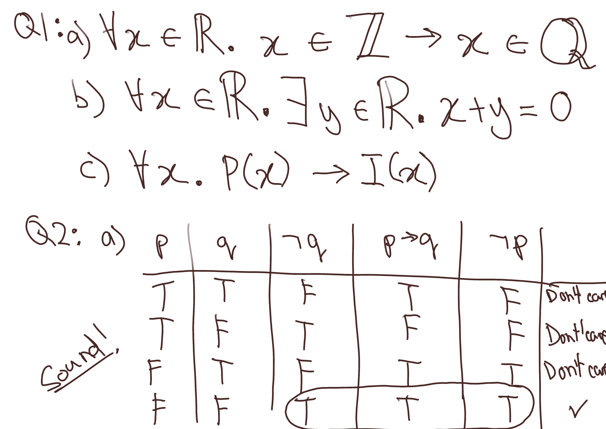
---

---
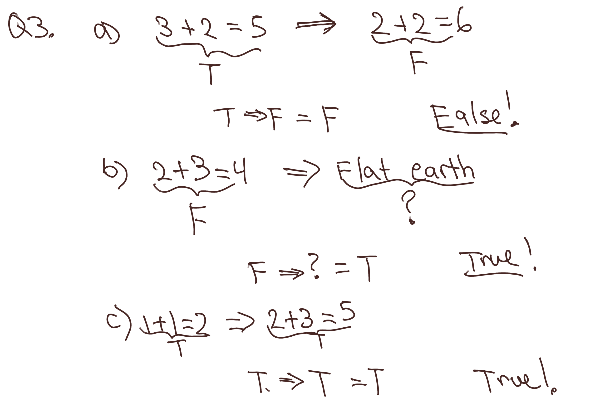
---

---
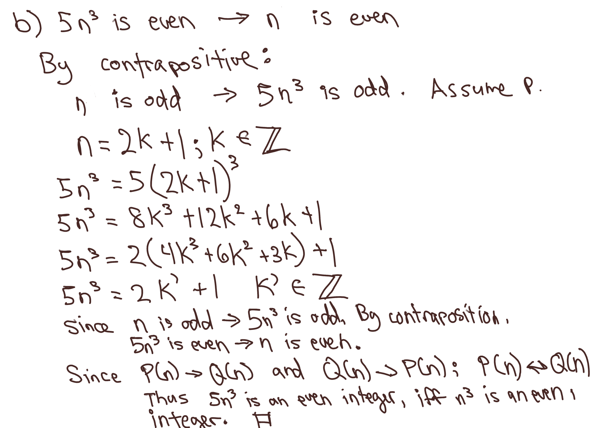
---
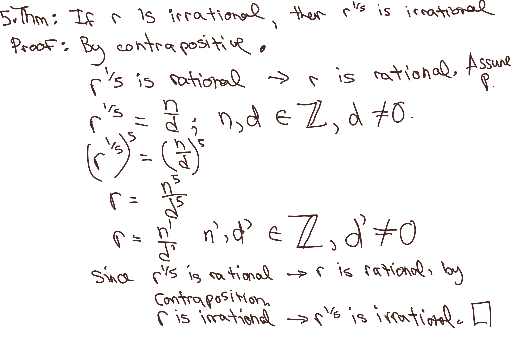
---
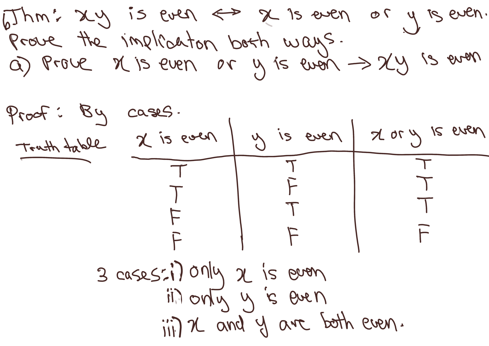
---
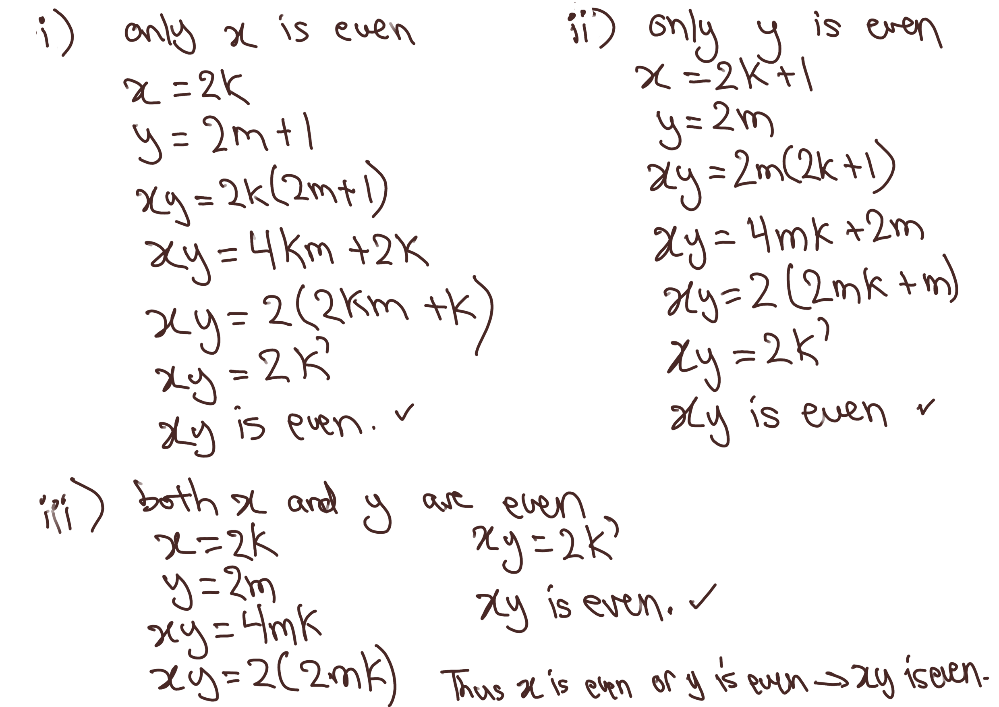
---
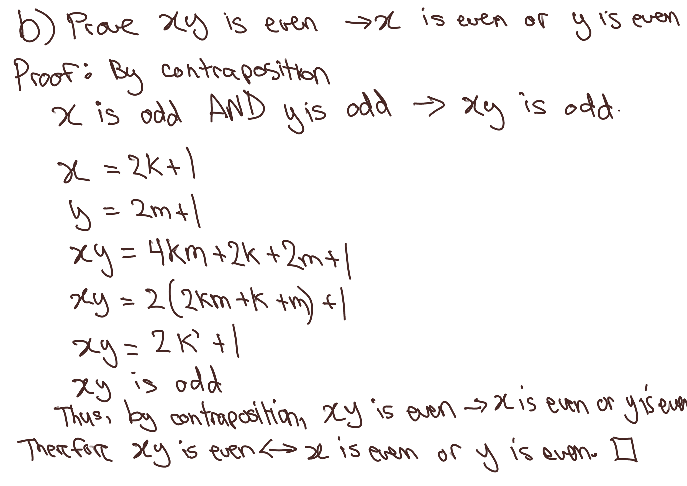
---

---
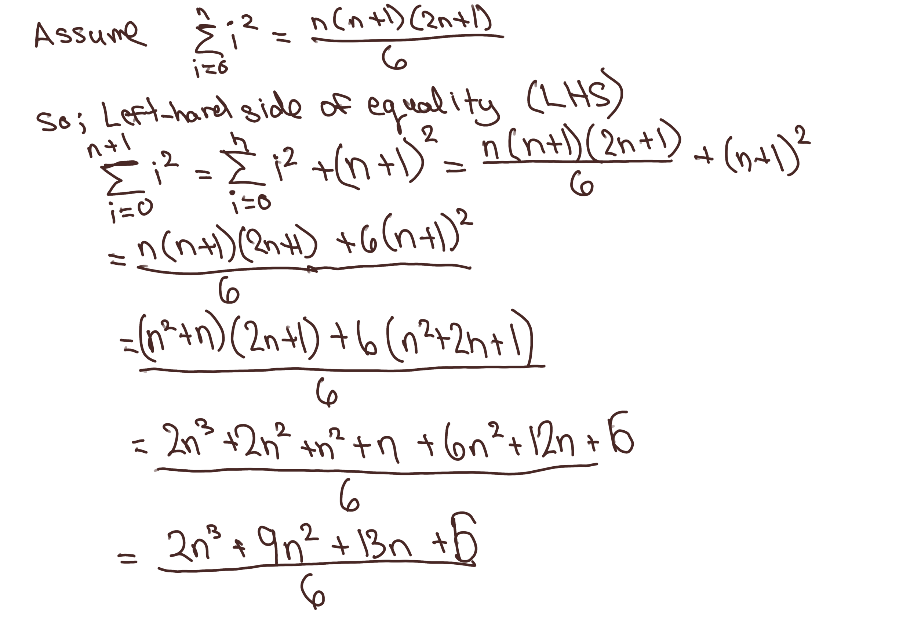
---
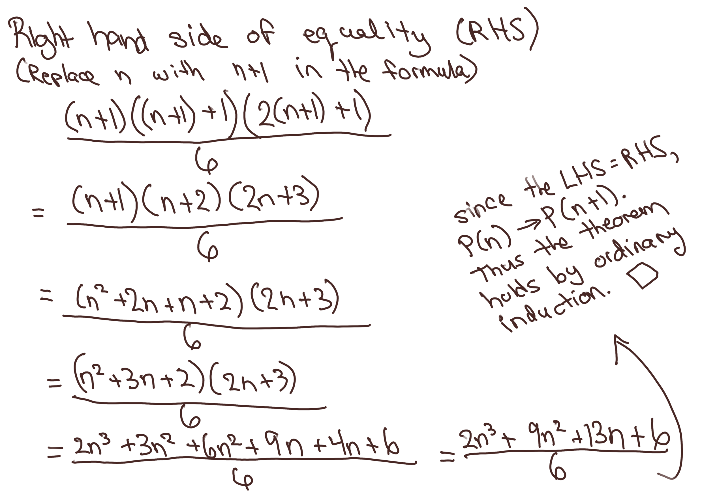
---
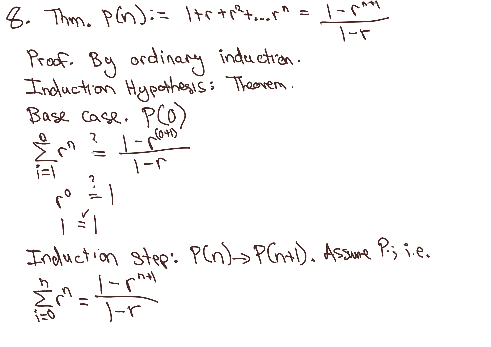
---
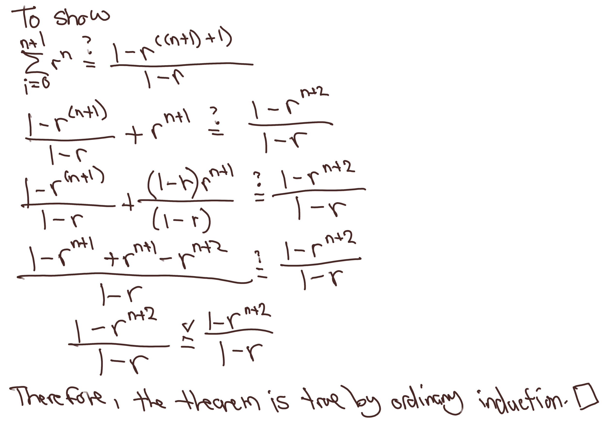
---
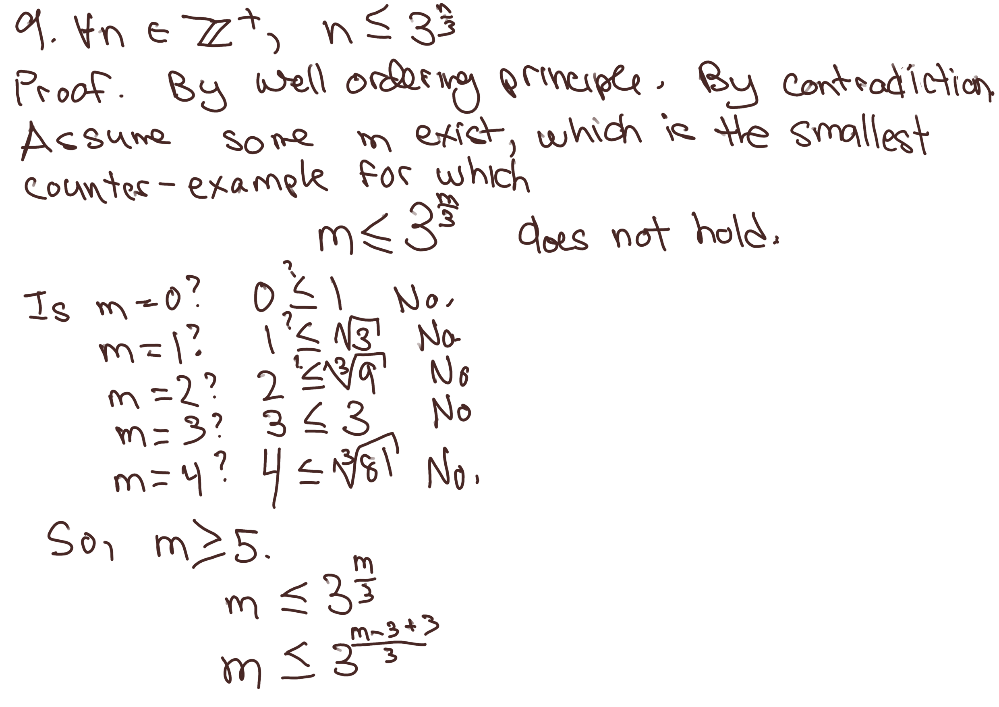
---
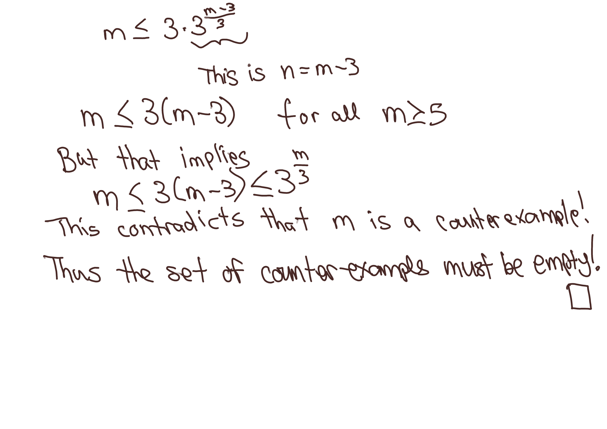
---

---
### References

These problems from:
Mathematics for Computer Science by Lehman, Leighton, Meyer, 2017
