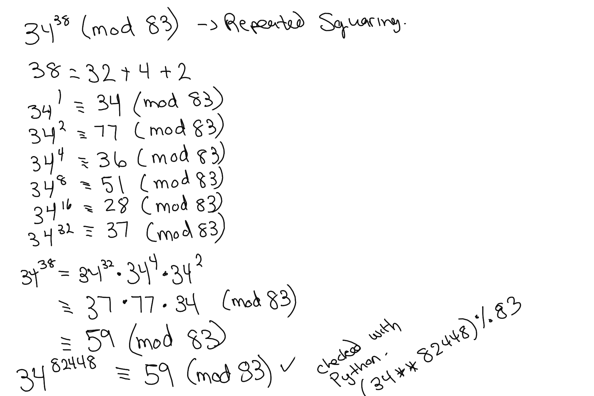
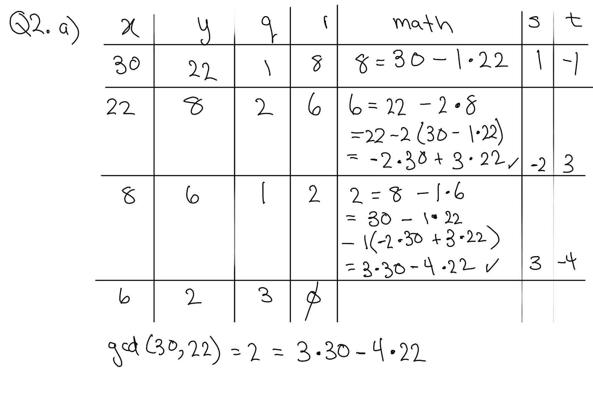
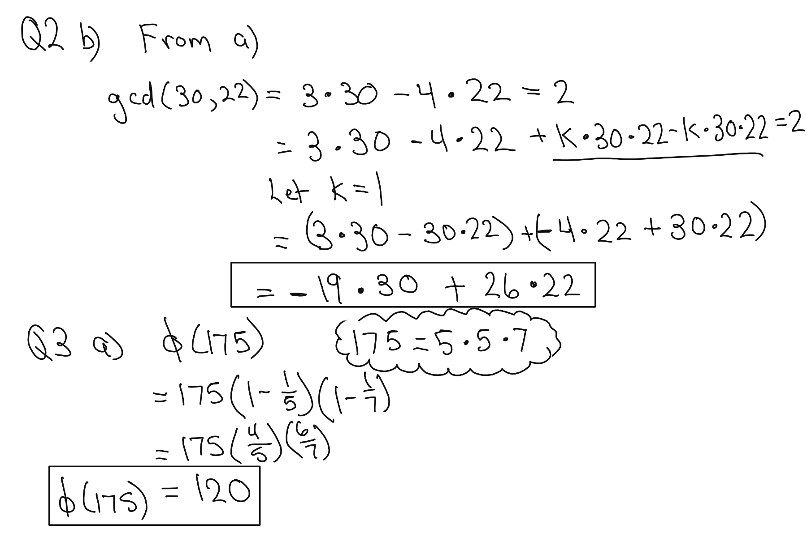
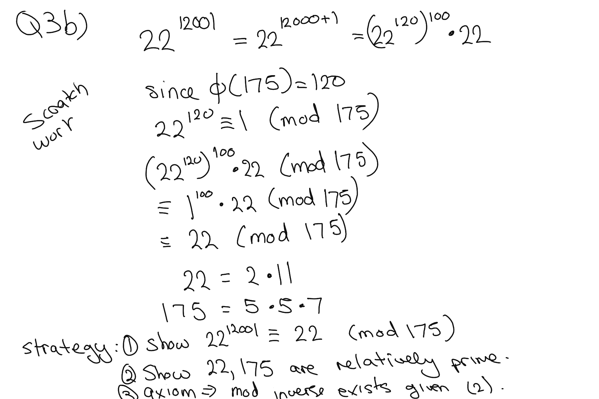
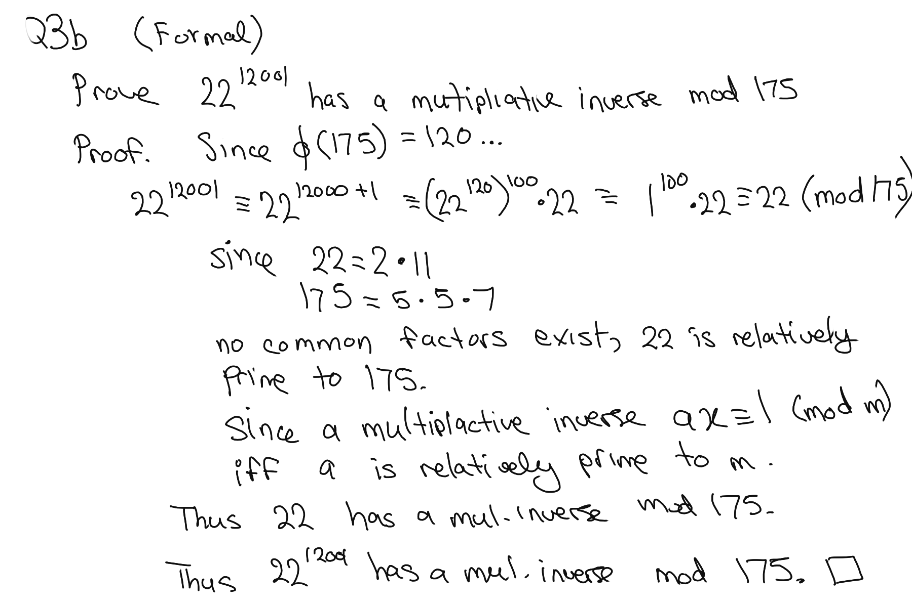
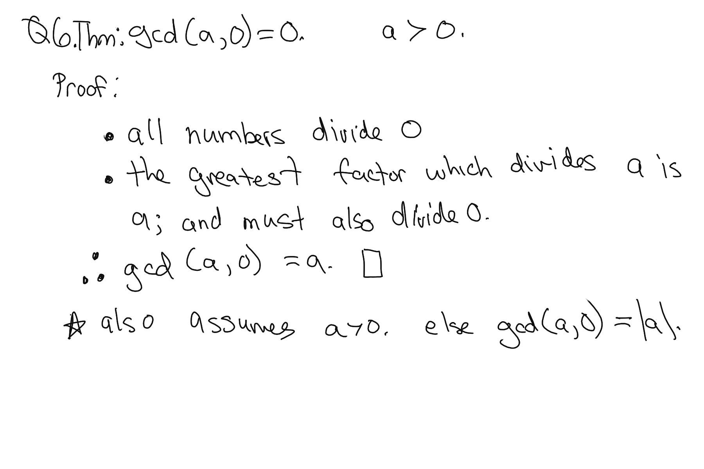
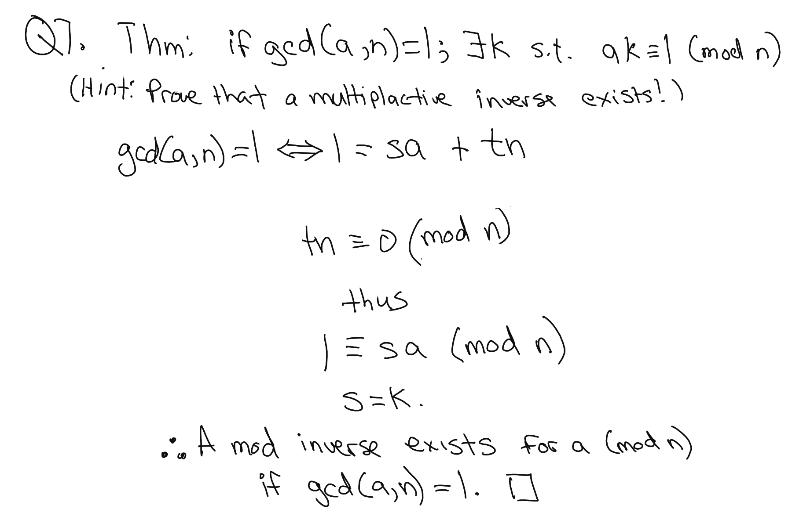
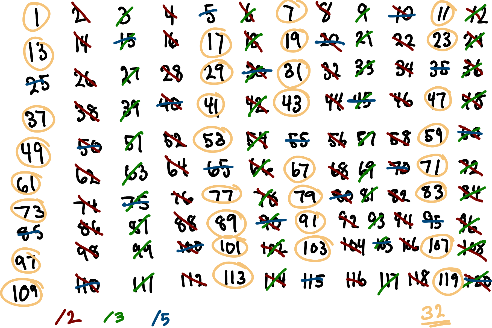
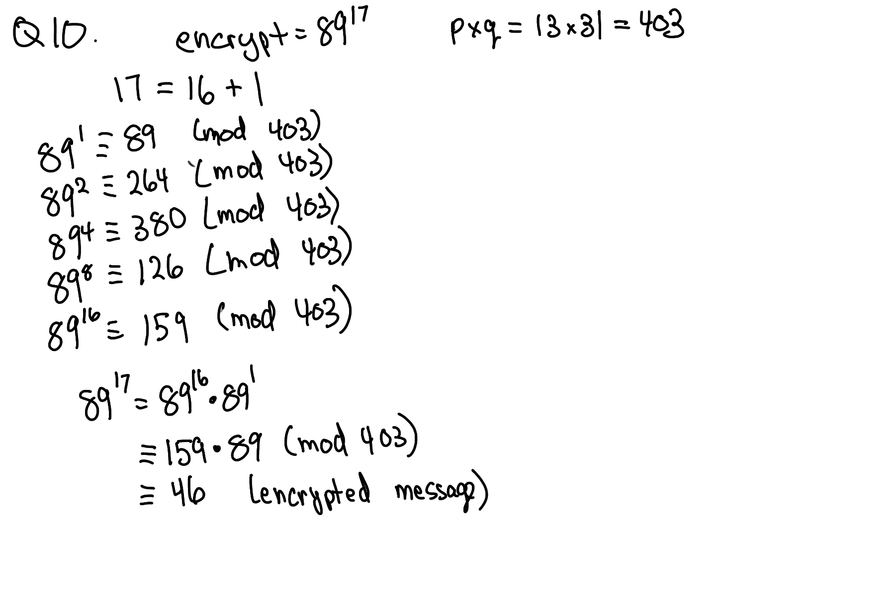
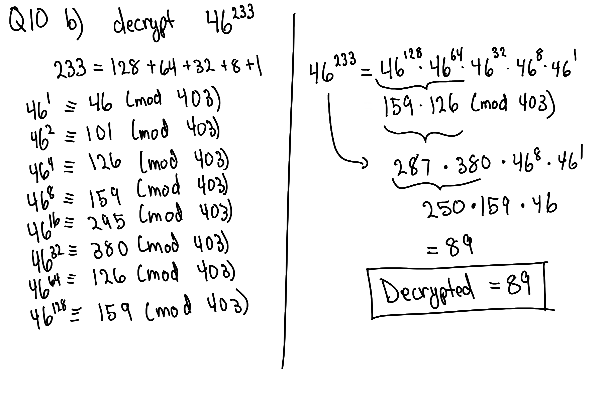

name: inverse
layout: true
class: center, middle, inverse
---
# ENSE 350: Math for Software Eng.

### Problem Set 2

Adam Tilson, M.A.Sc., Engineer-in-Training

---
layout: false
## Part 1: Number Theory

Q1. a) Use the Pulverizer to find integers $s$ and $t$ such that $135s + 59t = gcd(135,59)$

b) Use the previous result to find the inverse of $59$ (mod $135$) in the range {$1, ..., 134$}

c) Use Euler's Theorem to find the inverse of $17$ modulo $31$ in the range {$1, ..., 30$}

d) Compute $34^{82448}$ (mod $83$).

---

Q2. a)Use the pulverizer to find integers $x,y$ such that:

$30x + 22y = gcd(30,22)$

b) Now find integers $x', y', 0 \lt y \lt 30$ such that:

$30x' + 22y' = gcd(30,22)$

Q3. a) Find the value of $\phi(175)$, where $\phi$ is Euler's totient function.

b) Prove that $22^{12001}$ has a multiplicative inverse (mod $175$). Hint: $22 = 2 \times 11$

c) What is the remainder of $22^{12001}$ divided by $175$?

---

Q4. Find the gcd($m,n$) for the following: 

a) Let $m = 2^8 \times 3^9 \times 7^{11} \times 17^2 \times 19^2$, $n = 2^4 \times 5^7 \times 7^{13} \times 13^2 \times 17^3$

b) Let $m = 9!, n = 5 \times 7 \times 9 \times 11 \times 13 $ 

c) Let $m = 12340, n = 0$

---
## Part 2: Number Theory Proofs

Q5. Prove the Theorem: If $a \mid b$ and $b \mid a$ then $a = b, a,b \in \mathbb{Z}^+$

Q6. Prove the Theorem: If $a \neq 0$, gcd$(a,0) = a$ 

Q7. Prove the Theorem: If gcd$(a,n) = 1, \exists k $ such that

 $ ak \equiv 1 $(mod $n$) 

---

## Part 3: RSA

Q8. Consider an RSA Cryptosystem using the prime numbers $p = 13$ and $q = 11$. Answer the following:
- Could this system be used to directly encrypt all ascii values? Why or why not? (Hint: the maximum ASCII value is 127)
- Could this system be used to directly encrypt all UTF-8 values? Why or why not? (Hint: UTF uses up to 4 bytes, or 2^32 bits)
- Create a list of all the legal values for $e$. (You'll probably want to use a spreadsheet or python to help you with this!)

---
Q9. Consider an RSA Cryptosystem using the prime numbers $p = 13, q = 31, e=17$. Use the pulverizer to compute $d$.

Q10. Using the keys generated in Q9, encrypt the number $89$ using repeated squaring. Decrypt the encrypted result to verify.

???

Q9 - d: 233
Q10 - encrypted: 46

---

---

---

---

---

---

---

---

---

---

---

---

---

---

---

---

---

---

---

### References

These problems from:
Mathematics for Computer Science by Lehman, Leighton, Meyer, 2017
